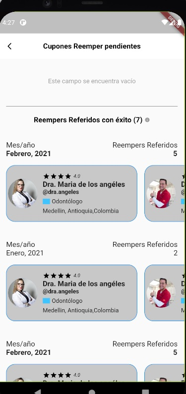

# WorkExample

my_work_example_by_rolango_garcia_workana

## Clean Architecture

Usually I use the Clean Architecture to structure my App

## Duration

2 hrs with 51 m 

## ScreenShoot

 :thumbsup:

## Testing Branch In GitHub

Util commands:

**git add .** (Add all the files in the stage (Prepare to commit))
**git push** (Send the new data to the repository in the cloud)
**git pull** (Get the latest data from the repository)
**git lg** (Show all commits in the repository) (Configure command)

**git branch** (Show all branches in the repository)
**git branch nameBranch** (Create a new branch)
**git checkout nameBranch** (Switch to another branch)
**git merge nameBranch** (Use this for a fast-merge) 
**git branch -d nameBranch** (-d (DELETE) Delete a branch. Use this if the brahch has been merged)

**git checkout -b nameBranch** (Create and switch to new branch)
**git diff branch1 branch 2** (Show the difference between branches)

**git commit -am "Your message"** (Add all data to stage and commit with a message)

## What happens if the branch is push to cloud?

First you should use **git push --set-upstream origin nameBranch**

